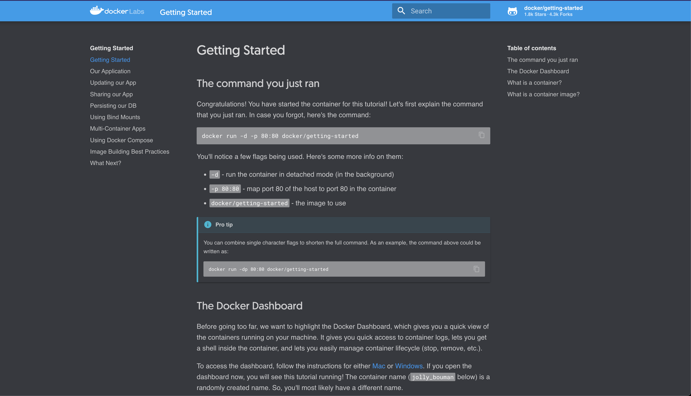

# Getting Started
## Running your first docker container
Now that we have everything setup, it's time to get our hands dirty. In this section, we are going to run a container on our system and get a taste of Docker.

To get started, let's run the following in our terminal:

### Pull the container image
```bash
docker pull docker/getting-started:latest
```

_Note: Depending on how you've installed docker on your system, you might see a permission denied error after running the above command. If you're on a Mac or Windows, make sure the Docker engine is running. If you're on Linux, then prefix your docker commands with sudo. Alternatively you can create a docker group to get rid of this issue._

You will see an output similar to this
```
latest: Pulling from docker/getting-started
Digest: sha256:aa945bdff163395d3293834697fa91fd4c725f47093ec499f27bc032dc1bdd16
Status: Image is up to date for docker/getting-started:latest
docker.io/docker/getting-started:latest
```

The pull command fetches the image from the Docker registry and saves it to our system. 

### Verify that the container image has been pulled
You can use the docker images command to see a list of all images on your system.

```bash
docker images
```

You will see an output similar to this
```
REPOSITORY               TAG       IMAGE ID       CREATED       SIZE
docker/getting-started   latest    bd9a9f733898   5 weeks ago   28.8MB
```


### Run the container
Great! Let's now run a Docker container based on this image. To do that we are going to use the almighty docker run command.

```bash
docker run -d -p 80:80 docker/getting-started
```

### Verify that the container is running
You can use the docker ps command to see a list of running containers on the system

```bash
docker ps
```

You can use the docker images command to see a list of all images on your system.
```
CONTAINER ID   IMAGE                    COMMAND                  CREATED          STATUS          PORTS                NAMES
5c5c3b36a3e6   docker/getting-started   "/docker-entrypoint.…"   1 minutes ago   Up 1 minutes   0.0.0.0:80->80/tcp   hardcore_margulis
```

_NOTE : The Container ID & NAMES fields will be generated at random. Hence, they will most likely be different on your system_

### The time for magic

1. Open any web browser
2. Open incognito mode or private mode
3. Open the URL ``localhost`` or `127.0.0.1`
4. You will see a getting started guide by docker on this URL. Similar to the screenshot below
   
5. Explore the Getting Started guide.
6. Close the incognito/private browser window.


### Stop the container

To stop the docker container, you can use the docker kill command

```
docker kill [CONTAINER ID]
```

You can get the container id from docker ps command ( e.g. `docker ps | awk 'NR>1 {print $1}'`). So the docker kill command according to the container created in this documentation is
```bash
docker kill 5c5c3b36a3e6
```

### Verify that the container has stopped running

Use the docker ps command again
```bash
docker ps
```

You will not see any containers in the table, similar to the output below
```
CONTAINER ID        IMAGE               COMMAND             CREATED             STATUS              PORTS               NAMES
```

### The magic will disappear too

Now that the container has stopped. The getting started web page will not be served on `localhost` anymore.

1. Open any web browser
2. Open incognito mode or private mode
3. Open the URL ``localhost`` or `127.0.0.1`
4. You will see an error implying that the URL is unreachable or refused connection (e.g. ERR_CONNECTION_REFUSED)

----

Takeaways & learnings from this exercise :

1. Introduction to docker cli commands
2. See principles of portability, ease of use, ease of distribution, virtualisation etc. for docker containers in action
3. The getting started guide is a great resource to refresh your learning of docker fundamentals